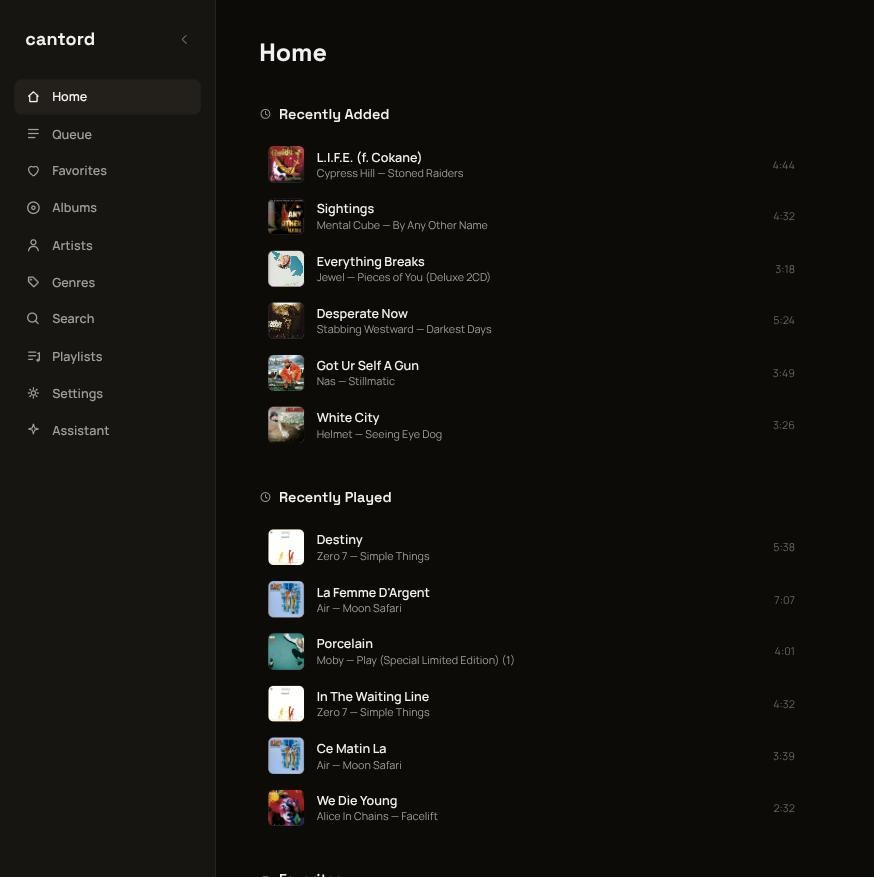
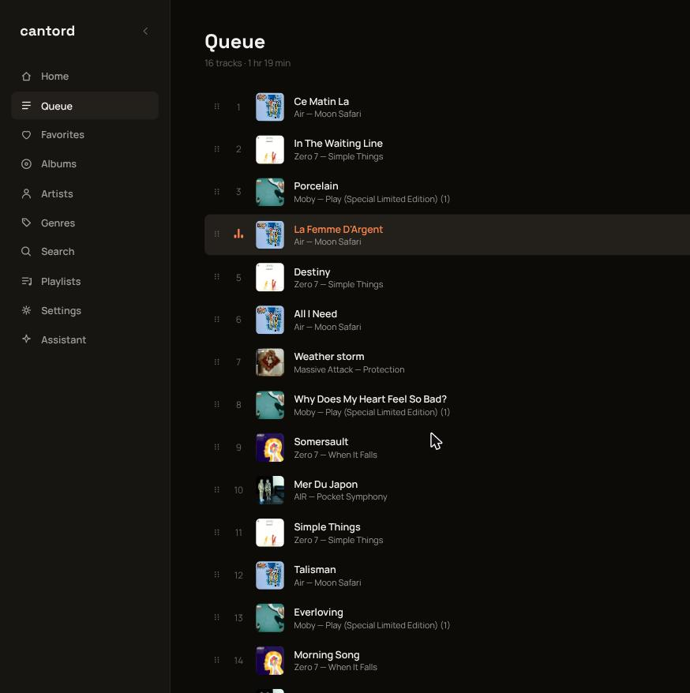
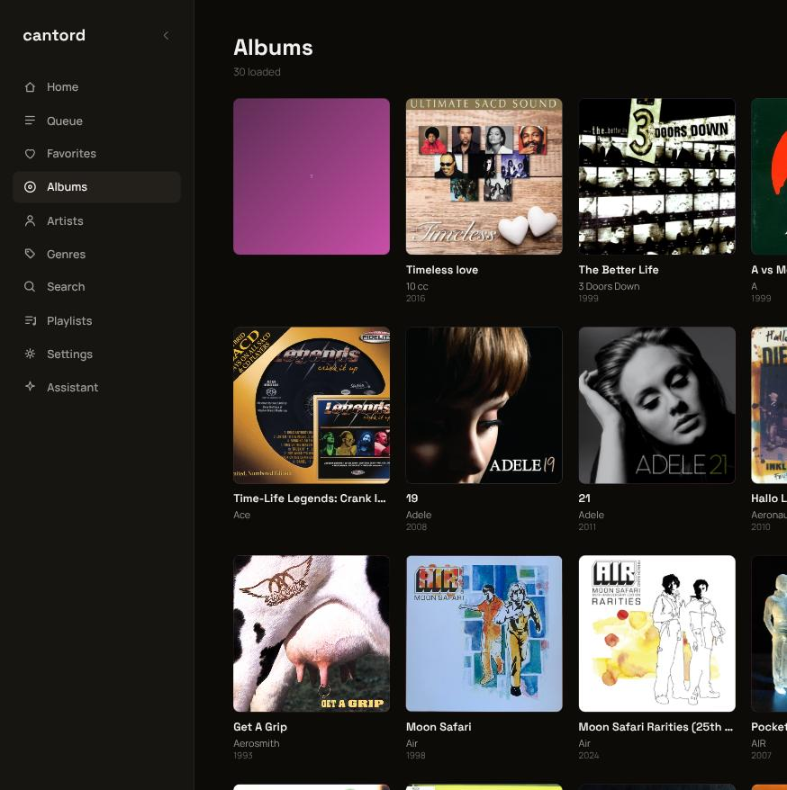
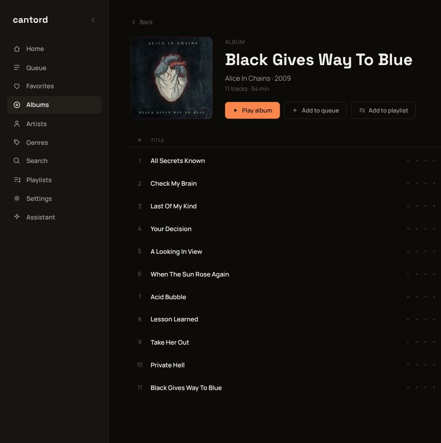
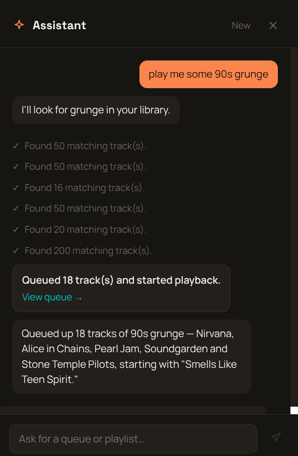

# cantord

A music daemon in the spirit of MPD, plus a web UI. Two independent
projects in one repo:

- **[`backend/`](backend)** — `cantord`, the Go daemon: library indexing,
  mpv-backed gapless playback, and an HTTP/JSON + SSE API. See
  [`backend/README.md`](backend/README.md) for design notes, build/run
  instructions, and the full API reference.
- **[`frontend/`](frontend)** — `cantord-frontend`, a React/TypeScript web
  UI that talks to the daemon's API. See
  [`frontend/README.md`](frontend/README.md) for dev setup.

They're decoupled at runtime — the frontend is a plain browser client
pointed at a daemon address (configurable in Settings, CORS-open by
design) — so each can be built, deployed, and versioned independently.

## Screenshots

<table>
<tr>
<td width="50%">

**Home**


</td>
<td width="50%">

**Queue**


</td>
</tr>
<tr>
<td width="50%">

**Albums**


</td>
<td width="50%">

**Album detail**


</td>
</tr>
</table>

**AI assistant** — chat-driven queue/playlist building, live against a real
library and a real Claude API key (see [Features](#features) below):



## Features

### Backend (`cantord`)

- Incremental, fingerprinted library scanning with filesystem watching
  (inotify/kqueue) for automatic rescans on change
- mpv-backed gapless playback; the queue and playback position are
  checkpointed to the database so a restart or crash resumes where you
  left off
- Real stream introspection via `ffprobe` (sample rate, bit depth,
  channels, codec) — hi-res files are reported as hi-res, not guessed
- Content-addressed album art cache with thumbnail generation,
  embedded-art extraction, and MusicBrainz/Cover Art Archive enrichment
  for what's missing
- Saved playlists (create, rename, delete, per-track add/remove/reorder),
  favorites, and ratings
- Full HTTP/JSON API with Server-Sent Events for live status, queue, and
  library-change push — no polling
- **AI assistant**: an optional LLM tool-calling layer (Claude API) that
  can search the library and build a queue or playlist from a plain
  chat request — it only ever acts on tracks a search actually
  returned, never an invented one. Runs fine with no API key configured
- Pure Go, no cgo — cross-compiles cleanly to FreeBSD

### Frontend (`cantord-frontend`)

- Home, Albums (jump-to-letter index, infinite scroll), Artists, Genres,
  Search, Playlists, Favorites, Recently Added/Played, and Queue views
- A slide-out **AI assistant** panel, streamed live, with tool activity
  shown inline and confirmation cards linking to the queue/playlist it
  built
- Drag-to-reorder playlists, and an "add to playlist" menu (existing or
  new) available from any track row or album
- Full playback transport (play/pause/seek/volume/shuffle/repeat) in a
  persistent player bar, with an animated now-playing indicator
- Real-time UI via the backend's SSE stream — queue, playback status, and
  library changes reflect instantly across the app, with a visible
  disconnected state if the daemon goes away
- Collapsible sidebar with per-section navigation memory (returning to a
  section resumes wherever you left it, not its list root)

## Quickstart

```sh
# backend
cd backend
go build ./cmd/cantord
cp configs/cantord.example.toml ~/.config/cantord/cantord.toml   # edit music_dirs
./cantord -config ~/.config/cantord/cantord.toml

# frontend, in another shell
cd frontend
npm install
npm run dev
```

Open the frontend's dev URL, then set the daemon address in Settings
(defaults to `http://localhost:8080`).
